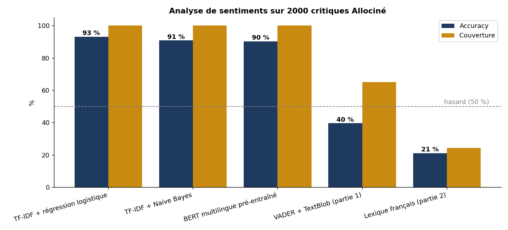
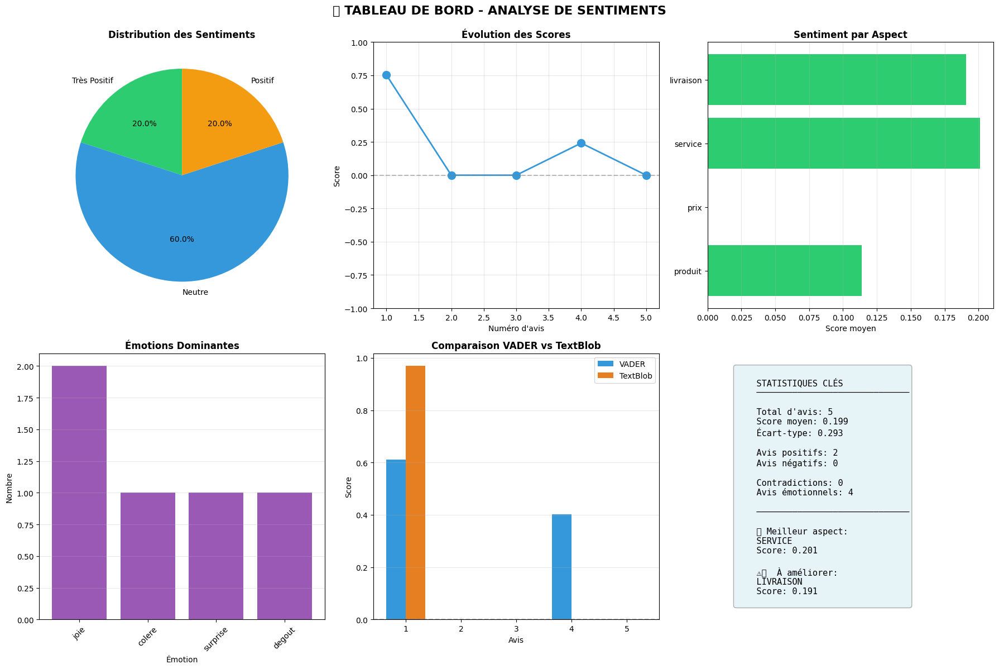

# 💬 Analyse de sentiments d'avis clients en français

> Projet de NLP en trois parties, Master Data & IA, Nexa Digital School.
> **Partie 1** : analyser un avis à plusieurs niveaux. **Partie 2** : constituer des données annotées. **Partie 3** : mesurer toutes les approches sur 2 000 vraies critiques en français.



## Résultat clé

Sur **2 000 critiques Allociné** annotées, un modèle **TF-IDF + régression logistique atteint 93,1 %** de bonnes réponses, contre **39,6 %** pour les outils conçus pour l'anglais utilisés au départ.

| Méthode | Accuracy | F1 | Couverture | Précision quand elle tranche |
|---|---|---|---|---|
| **TF-IDF + régression logistique** | **93,1 %** | 0,931 | 100 % | 93,1 % |
| TF-IDF + Naive Bayes | 90,8 % | 0,908 | 100 % | 90,8 % |
| BERT multilingue pré-entraîné, jamais vu Allociné | 90,2 % | 0,902 | 100 % | 90,2 % |
| VADER + TextBlob (partie 1) | 39,6 % | 0,477 | 65 % | 60,8 % |
| Lexique français (partie 2) | 21,1 % | 0,338 | 24 % | 86,6 % |

## Le fil conducteur

1. J'ai d'abord construit un **système d'analyse multi-niveaux**. Il fonctionne de bout en bout, mais ses résultats sur des avis en français sont souvent faux, et rien ne permet de **mesurer** à quel point.
2. J'ai ensuite construit la brique qui manquait : un **pipeline de création de dataset annoté**, avec un lexique **français**, un modèle supervisé et une stratégie qui donne la priorité à l'annotation humaine.
3. Enfin, j'ai **mesuré** toutes ces approches sur un vrai corpus annoté, pour transformer des intuitions en chiffres.

> Un modèle ne vaut que par les données sur lesquelles on peut l'évaluer.

---

## Partie 1 : analyse multi-niveaux

📓 [`notebooks/01_analyse_multi_niveaux.ipynb`](notebooks/01_analyse_multi_niveaux.ipynb)



Un simple « positif / négatif » ne suffit pas pour un avis comme : *« Le téléphone est excellent [...]. Cependant, la caméra est décevante et le prix trop élevé. Service client impeccable ! »*. Le système l'analyse donc à quatre niveaux :

```
CompleteSentimentSystem (orchestrateur)
├── DocumentSentimentAnalyzer   → score global : VADER + TextBlob, 5 classes
├── SentenceSentimentAnalyzer   → découpage avec spaCy, détection de contradictions
├── AspectBasedAnalyzer         → produit, prix, service, livraison
└── EmotionDetector             → 6 émotions (lexique français), intensité de 0 à 1
```

Le système produit un résumé global, des recommandations, un tableau de bord de 6 graphiques et un export en tableau. Des tests unitaires sont intégrés au notebook.

**Ce que révèlent les résultats** (5 avis en français) :

| Avis | Classement obtenu | Attendu |
|---|---|---|
| « Rien à redire ! Produit parfait [...]. Je recommande vivement ! » | Neutre (0,0) | Très positif |
| « [...] produit arrivé endommagé. Je suis très frustré et déçu. » | Neutre (0,0) | Négatif |
| « [...] Support technique lent à répondre. » | Phrase jugée positive (0,40) | Négative |

**Pourquoi ?** VADER et TextBlob sont conçus pour **l'anglais** : sur du français, ils reconnaissent peu de mots et renvoient souvent un score nul. Le découpage en phrases, la détection des aspects et le lexique d'émotions, qui s'appuient sur des ressources françaises, fonctionnent correctement.

---

## Partie 2 : créer un dataset annoté

📓 [`notebooks/02_creation_dataset_etiquete.ipynb`](notebooks/02_creation_dataset_etiquete.ipynb)

Un pipeline en 5 étapes pour transformer des avis bruts en données d'entraînement fiables :

| Étape | Ce que fait le code |
|---|---|
| 1. Collecte | Avis clients de restaurant, enrichis d'exemples difficiles : **ironie** et expressions idiomatiques (« le "service impeccable" était en fait une attente de 45 minutes ») |
| 2. Annotation manuelle | Outil interactif d'étiquetage (négatif / neutre / positif), sauvegardé en JSON |
| 3. Annotation automatique | **Lexique français pondéré** (« excellent » +3, « catastrophique » -3…) et **modèle Naive Bayes** (scikit-learn) |
| 4. Fusion | Priorité absolue aux annotations humaines ; une annotation automatique n'est gardée que si la confiance du modèle dépasse **0,7** |
| 5. Qualité et amélioration | Contrôle des valeurs manquantes, des doublons, de l'équilibre des classes ; découpage entraînement / validation / test ; boucle où l'humain corrige les erreurs du modèle |

---

## Partie 3 : évaluation sur 2 000 critiques Allociné

📓 [`notebooks/03_evaluation_corpus_allocine.ipynb`](notebooks/03_evaluation_corpus_allocine.ipynb)

Cinq approches comparées sur exactement les mêmes 2 000 critiques de films en français (corpus Allociné, positif / négatif), avec 20 000 critiques pour l'entraînement des modèles supervisés.

**Ce que montrent les résultats :**

1. **Les outils conçus pour l'anglais ne conviennent pas au français.** Même quand VADER et TextBlob tranchent, ils n'ont raison que dans 60,8 % des cas, à peine mieux que le hasard. Le diagnostic de la partie 1 est confirmé.
2. **Le lexique français est précis mais trop étroit.** Il a raison dans 86,6 % des cas quand il tranche, mais ne reconnaît que 24 % des avis : 20 mots ne couvrent pas la diversité du vocabulaire. C'est le compromis entre précision et couverture.
3. **Le volume de données change tout.** Le Naive Bayes de la partie 2, entraîné sur 20 000 avis au lieu de 6 phrases, atteint 90,8 %.
4. **Le meilleur modèle est aussi le plus simple** : TF-IDF + régression logistique, 93,1 %, entraîné en quelques secondes. Les mots qu'il a appris sont parlants : « excellent », « magnifique », « superbe » d'un côté ; « ennuyeux », « navet », « ridicule » de l'autre.
5. **Le modèle pré-entraîné généralise très bien** : 90,2 % sans avoir jamais vu Allociné, mais il est nettement plus lent (53 s sur GPU pour 2 000 avis).
6. **Cas difficiles** : sur nos deux exemples d'ironie (« Super, j'ai attendu 2h pour être servi ! »), la régression logistique répond juste et BERT se trompe ; aucun modèle ne comprend l'expression « à tomber par terre ». Avec si peu d'exemples, c'est une observation plutôt qu'une conclusion générale.

## Limites et pistes d'amélioration

- Le corpus Allociné ne contient que des avis **positifs ou négatifs** : les avis mitigés et neutres ne sont pas évalués.
- Les cas d'ironie et d'expressions idiomatiques sont testés sur une poignée d'exemples seulement.
- Prochaines étapes : affiner un modèle français (CamemBERT) sur Allociné, et constituer un jeu d'avis ironiques annotés pour évaluer spécifiquement ces cas.

## Ce que j'ai appris

- **Adapter l'outil à la langue des données** : un système peut sembler fonctionner (aucune erreur, de beaux graphiques) tout en produisant des résultats faux.
- **Sans données annotées, pas d'évaluation** : c'est l'annotation, pas le modèle, qui rend un projet de NLP fiable.
- **Le modèle le plus simple peut être le meilleur** : avant de sortir un modèle de langage, il faut mesurer une base solide comme TF-IDF + régression logistique.
- **L'humain reste prioritaire** sur les cas difficiles : ironie, négations, avis mitigés.

## Lancer le projet

Ouvrir les notebooks dans **Google Colab** et exécuter les cellules dans l'ordre. Pour la partie 3, activer un GPU (*Exécution → Modifier le type d'exécution*) : le corpus et le modèle BERT sont téléchargés automatiquement. En local :

```bash
pip install -r requirements.txt
python -m spacy download fr_core_news_md
python -m textblob.download_corpora
jupyter notebook
```

## Structure du dépôt

```
├── notebooks/
│   ├── 01_analyse_multi_niveaux.ipynb       # partie 1 : système d'analyse à 4 niveaux
│   ├── 02_creation_dataset_etiquete.ipynb   # partie 2 : pipeline d'annotation en 5 étapes
│   └── 03_evaluation_corpus_allocine.ipynb  # partie 3 : comparaison de 5 méthodes sur Allociné
├── images/
│   ├── comparaison_methodes.png
│   └── tableau_de_bord_partie1.png
└── requirements.txt
```

## Stack

Python · spaCy · VADER · TextBlob · scikit-learn (TF-IDF, Naive Bayes, régression logistique) · Hugging Face (datasets, transformers) · BERT · pandas · Matplotlib · Seaborn

---

👩‍💻 **Nosaiba Elkrekshi** · Master 2 Data & IA · [LinkedIn](https://www.linkedin.com/in/nosaiba-elkrekshi) · nosaiba.elkrekshi@gmail.com
